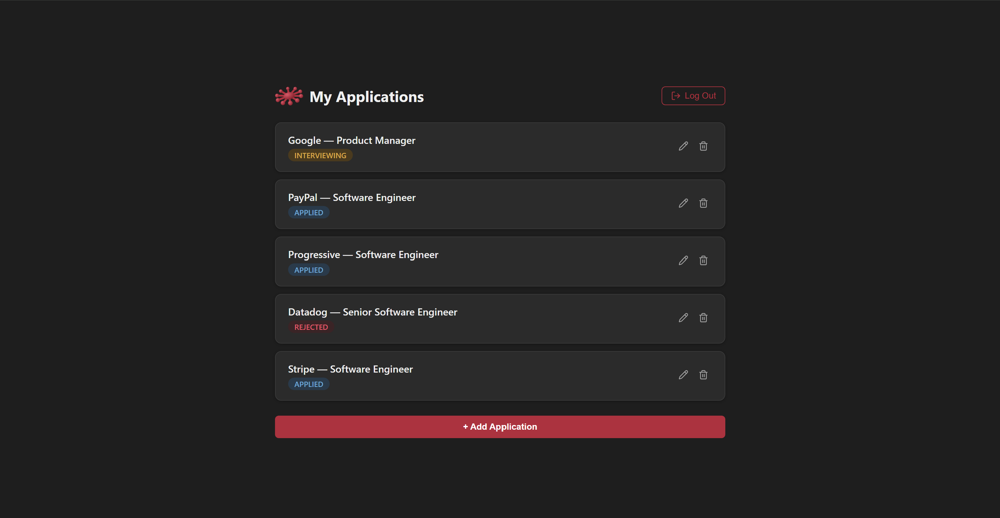
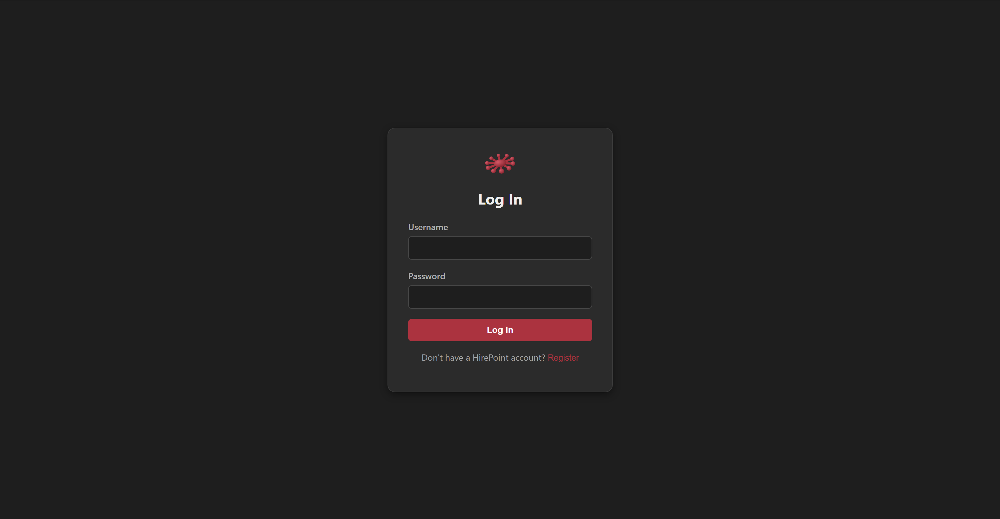
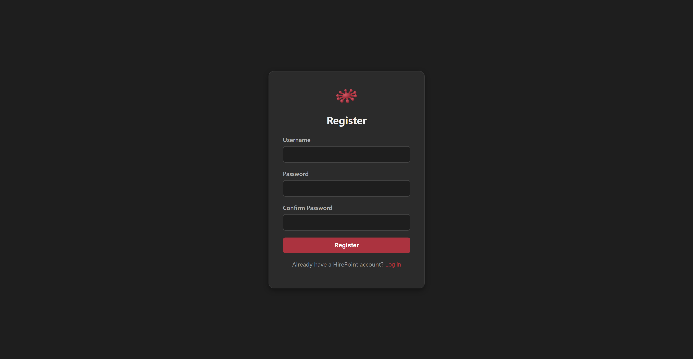
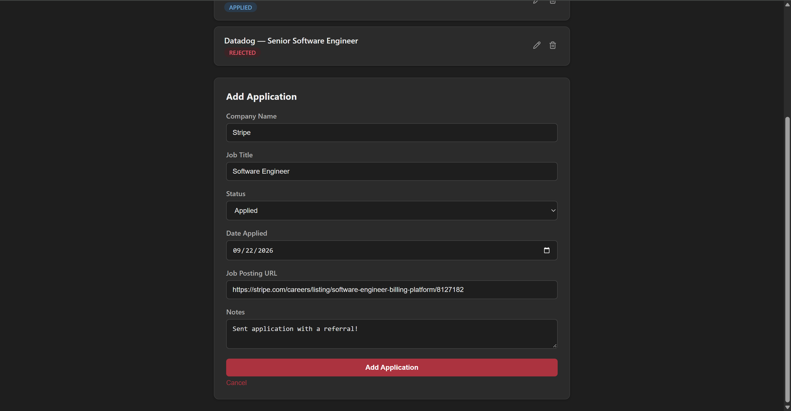

# HirePoint

A full-stack job application tracker — register, log in, and manage your job search with a clean, dark-themed dashboard. Built end-to-end from a single Spring Boot endpoint through to a fully deployed, HTTPS-secured production app on AWS.

**Live app:** [https://hirepoint.dev](https://hirepoint.dev)

---

## Screenshots

<p align="center">
  <br>
  <em>Dashboard — track every application's status at a glance</em>
</p>

<p align="center">
  
  <br>
  <em>Login and registration</em>
</p>

<p align="center">
  <br>
  <em>Adding a new application</em>
</p>

---

## Features

- **Authentication** — register/login with JWT-based auth, passwords hashed with BCrypt
- **Full CRUD** — create, view, edit, and delete job applications, each scoped to the logged-in user with ownership checks on every write
- **Application tracking** — company name, job title, status (Applied / Interviewing / Offer / Rejected), date applied, job posting URL, and notes
- **Server-side validation** — required fields enforced with Jakarta Bean Validation, in addition to client-side checks
- **Logging** — structured request/event logging (SLF4J) for auth and application actions
- **Dark UI** — custom charcoal/red theme, color-coded status badges, inline editing, collapsible add-application form

## Tech Stack

**Backend**
- Java 21, Spring Boot 4
- Spring Web, Spring Data JPA (Hibernate), Spring Security
- JWT authentication (jjwt)
- PostgreSQL
- Jakarta Bean Validation

**Frontend**
- React + TypeScript (Vite)
- Plain CSS (no framework) — custom dark theme
- lucide-react icons

**Infrastructure**
- **Docker** — multi-stage build for the backend, Docker Compose for local dev (Spring Boot + Postgres)
- **AWS RDS** — managed PostgreSQL
- **AWS ECR / ECS (Fargate)** — containerized backend, run behind an Application Load Balancer
- **AWS S3** — static hosting for the built React app
- **AWS CloudFront** — CDN + HTTPS for the frontend
- **AWS ACM** — SSL certificates for both the frontend (CloudFront) and backend (ALB)
- **Cloudflare** — domain registration and DNS for `hirepoint.dev`

## Architecture

```
Browser
  │
  ├── https://hirepoint.dev  ──────────▶  CloudFront  ──▶  S3 (React static build)
  │
  └── https://api.hirepoint.dev  ──────▶  Application Load Balancer  ──▶  ECS Fargate (Spring Boot)  ──▶  RDS (PostgreSQL)
```

- The frontend is a static React build served via CloudFront, giving HTTPS and CDN caching in front of a private S3 bucket.
- The backend runs as a Docker container on ECS Fargate, sitting behind an Application Load Balancer for a stable, HTTPS-secured URL — no direct dependency on any single task's IP.
- The database is a managed PostgreSQL instance on RDS, reachable only from the backend's security group.
- CORS is locked down to the production frontend origin; the backend exposes a public `/health` endpoint specifically for the load balancer's health checks.

## Running Locally

**Backend** (requires Docker):

```bash
git clone https://github.com/Beglii/hirepoint.git
cd hirepoint
cp .env.example .env   # fill in your own DB password and JWT secret
docker compose up --build
```

This starts the Spring Boot API (`localhost:8080`) and a PostgreSQL container together.

**Frontend:**

```bash
cd hirepoint-frontend
npm install
npm run dev
```

Runs the React app at `localhost:5173`, configured to talk to the local backend.

## API Overview

| Method | Endpoint | Auth required | Description |
|---|---|---|---|
| POST | `/api/auth/register` | No | Create a new account |
| POST | `/api/auth/login` | No | Log in, returns a JWT |
| GET | `/api/applications` | Yes | List the current user's applications |
| POST | `/api/applications` | Yes | Create a new application |
| PUT | `/api/applications/{id}` | Yes | Update an application (owner only) |
| DELETE | `/api/applications/{id}` | Yes | Delete an application (owner only) |
| GET | `/health` | No | Health check (used by the load balancer) |

## About This Project

HirePoint was built as a learning project to go deep on the full stack — not just writing CRUD endpoints, but understanding *why* each piece exists: dependency injection, JWT auth from first principles, containerization, and a real cloud deployment with a load balancer, custom domain, and SSL, all built and debugged from scratch.

---

Built by [Begli Rejepov](https://linkedin.com/in/beglirejepov) — [GitHub](https://github.com/Beglii)
